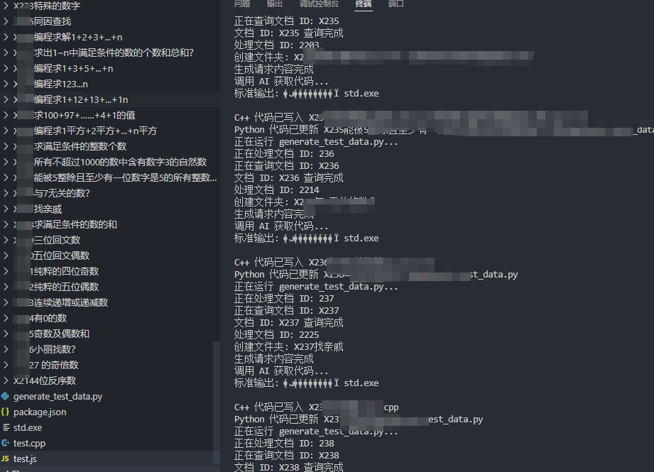

# AI 极速生成 OJ 题目测试数据

## 你是否面临这样的困境？

- **如何在一天之内生成几千道测试数据？**
- **如何在短时间内确保测试数据的多样性和质量？**
- **如何避免繁琐的手工编写测试数据的过程？**

如果你曾经面临过这些问题，那么你绝对不容错过这个项目！



## 介绍

为你带来了 **AI 极速生成 OJ 题目测试数据** 的解决方案。通过结合先进的大模型技术，我们可以在极短的时间内生成大量高质量的测试数据，大大提升你的开发效率和测试质量。

### 项目背景

在传统的出题中，编写测试数据是一个耗时且枯燥的工作。尤其是在需要生成大量数据以覆盖各种测试场景时，这一过程变得尤为繁琐和费力。手工生成测试数据不仅效率低下，而且容易出错。

### 项目目的

本项目旨在通过 AI 技术来解决这些问题，自动化生成 OJ（在线评测）题目的测试数据。通过我们的解决方案，你可以：

- **快速生成大量测试数据**：不再需要手工编写测试数据，我们的 AI 模型可以在短时间内生成几千道题目的测试数据。
- **提高数据质量**：生成的数据符合题目要求，确保测试的全面性和准确性。
- **减少人为错误**：自动化的过程减少了手工操作带来的错误风险。

### 如何工作？

我们利用深度学习模型和自然语言处理技术，通过以下几个步骤来生成测试数据：

1. **题目描述解析**：从题目描述中提取关键信息。
2. **生成 C++ 解题代码**：通过 AI 自动生成符合题目要求的 C++ 代码。
3. **生成 Python 测试数据**：生成符合题目要求的 Python 函数，用于自动化生成测试数据。
4. **文件和代码管理**：将生成的代码和数据文件保存到指定目录，并进行必要的编译和测试。

### 大模型结合的好处和优势

- **高效**：AI 模型能够在极短的时间内生成大量测试数据，显著提高工作效率。
- **精准**：基于题目要求生成的数据更加准确，减少了人为错误的风险。
- **灵活**：支持多种题型和测试数据生成需求，满足不同的测试场景。

### 使用方法

1. **克隆项目**：
    ```bash
    git clone https://github.com/yviscool/ai-oj-test-data-generator.git
    cd ai-oj-test-data-generator
    ```

2. **安装依赖**：
    ```bash
    npm install
    ```

3. **配置 API 密钥和数据库连接**：
    编辑 `config.js` 文件，添加你的 OpenAI API 密钥和 MongoDB 数据库连接信息。

4. **运行程序**：
    ```bash
    node index.js
    ```

### 项目目标

我们的目标是通过 AI 技术简化测试数据的生成过程，帮助开发者和测试人员更高效地完成任务。我们不断改进模型和算法，以支持更复杂的题型和更高质量的测试数据生成。

希望快速测试数据生成器能够帮助你更高效地生成测试数据，节省时间和精力。如果你有任何问题或建议，请随时联系我们。
